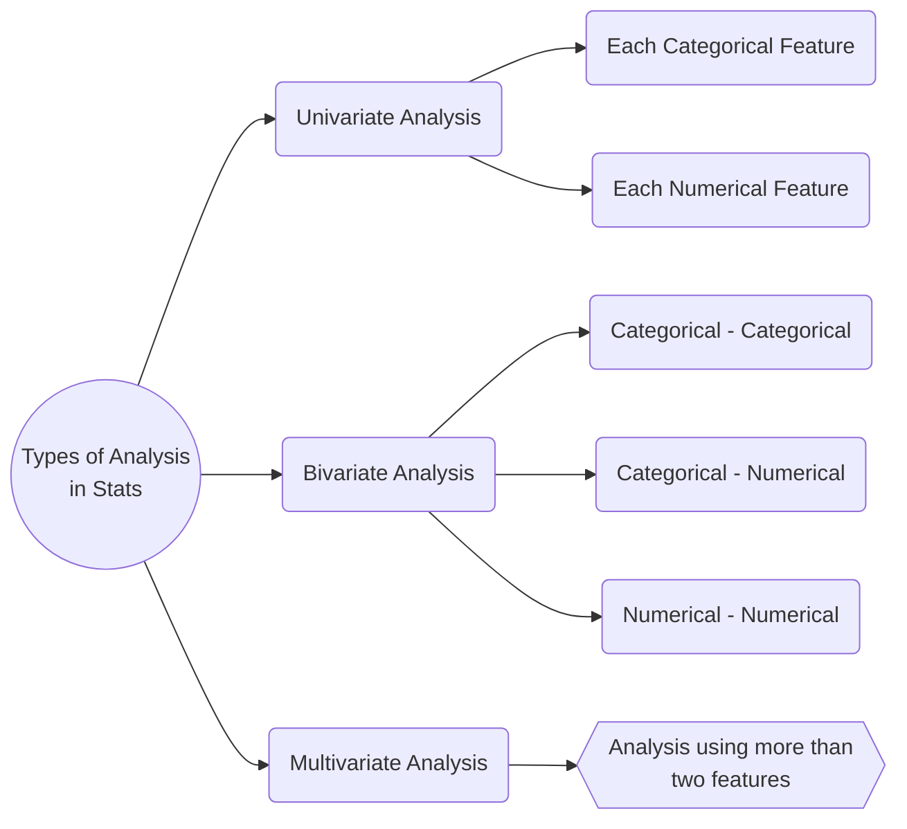

# Analysis with Statistics

## Table of Contents

0. [Resources](#resources)

1. [Types of Analysis](#types-of-analysis)

2. [Univariate Analysis](#univariate-analysis)

   - [Categorical](#categorical)
   - [Numerical](#numerical)

3. [Bivariate Analysis](#bivariate-analysis)

   - [Categorical - Categorical](#categorical---categorical)
   - [Numerical - Numerical](#numerical---numerical)
   - [Categorical - Numerical](#categorical---numerical)

4. [Multivariate Analysis](#multivariate-analysis)

## Resources

- [Video](https://www.youtube.com/watch?v=1ndVC500-EU&list=PLKnIA16_RmvbYFaaeLY28cWeqV-3vADST&index=2)
- [PDF](./docs/Analysis%20with%20Statistics.pdf)
- [Notebook](https://colab.research.google.com/drive/19YlpW_N7idyQQvmpgrZg8KNSvIjCPk-8?usp=sharing)

## Topics

### Types of Analysis

### Univariate Analysis

#### Categorical

1. **Frequency Distribution Table** is a table that summarizes the number of time (or frequency) that each value occurs in the dataset.

2. **Relative frequency** is the proportion or percentage of a category in a dataset or sample.
   It is calculated by dividing the frequency of a category by the total number of observations in the dataset or sample.

3. **Cumulative frequency** is the running total of frequencies of a variable or category in a dataset or sample. It is calculated by adding up the frequencies of the current category and all previous categories in the dataset or sample.

#### Numerical

1. **Frequency Distribution Table or Histogram** is being made using binning method for numerical data. It calculate the number of data falls in each bins.
   Here, every bins works as category of particular data.

### Bivariate Analysis

#### Categorical - Categorical

1. **Contingency Table or Cross-Tabulation** is used to summarize the relationship between two categorical variables.
   It shows the frequencies or relative frequencies of the observed values of two variables.

#### Numerical - Numerical

1. **Scatter Plot** tells the positive/negative relationship of two numerical datasets.

2. **Regression Plot** is a special scatter plot which also draw a line.

3. **Jointplot** is display two plots at a time scatter plot and histogram both.

#### Categorical - Numerical

1. **Quantiles** are used to divide the data into equal-sized groups.  
   Quantiles are important measures of variability and can be use to understand distribution of data, summarize and compare different datasets. They can also be used to identify outliers.

There are several types of quantiles used in statistics such as **Quartiles, Deciles, Percentiles, Quintiles** but the most important one is **Percentile** because it divides the data into 100 equal parts.

2. **Percentile** is a measure that represents the percentage of dataset that falls below a particular value.  
   _For example,_ the 75th percentile is the value below which 75% of the observations in the dataset fall.

3. **Inter Quartile Range (IQR)** is a the difference between the third quartile (Q3) and the first quartile (Q1) of a dataset.

4. **Five number summary** represents the Minimum, Q1, Q2 (Median), Q3 and Maximum. Where,  
   $$ \text{Minimum} = \text{Q1} - (1.5 \ast \text{IQR}) $$  
   $$ \text{Maximum} = \text{Q1} + (1.5 \ast \text{IQR}) $$

   Five number summary generally visualize using **Box Plot or Whisker Plot,**.

   

- **Benefits of a Box Plot:**

  - Easy way to see the **distribution of data**.
  - Tells about **skewness of data**.
  - Can **identify outliers**.
  - **Compare 2 categories** of data.

5. **Covariance** describes the degree to which two variables are linearly related. It measures how much two variables change together, such that when one variable increases, does the other variable also increase, or does it decrease?  
   A covariance of zero indicates that the variables are not linearly related.

   

- **Disadvantages of using Covariance**  
   One limitation of covariance is that it does not tell us about the **strength of the relationship between two variables**, since the magnitude of **covariance is affected by the scale of the variables**.

6. **Correlation** measures the degree to which two variables are related and how they tend to change together.  
   Correlation is often measured using a statistical tool called the correlation coefficient, which ranges from -1 to 1. A correlation coefficient of -1 indicates a perfect negative correlation, a correlation coefficient of 0 indicates no correlation, and a correlation coefficient of 1 indicates a perfect positive correlation.

$$ \text{Correlation} = \frac{Cov(x, y)}{\sigma x \ast \sigma y} $$

> **Note:** Correlation does not imply causation means if two variables are correlated then it does means that other variable is affected by first variable or vice-versa.

### Multivariate Analysis

1. **3D Scatter Plot**

2. **Plots Parameters** are used to display another impact of another categorical or numerical variable in the plot.

   - Hue/Color Parameter
   - Size Parameter

3. **Facet Grids**

4. **Pairplot**

5. **Bubble Chart**
