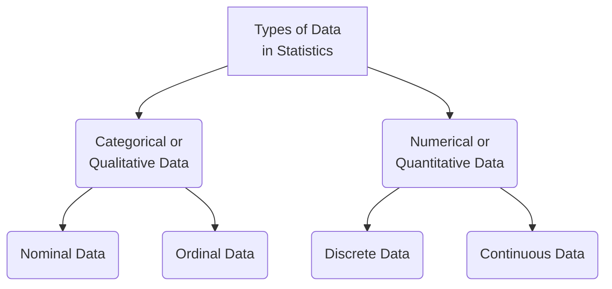

# Descriptive Statistics

## Table of Contents

0. [Resources](#resources)
1. [What is Statistics?](#what-is-statistics?)
2. [Types of Statistics](#types-of-statistics)
3. [Population and Sample](#population-and-sample)
4. [Types of Data in Statistics](#types-of-data-in-statistics)
5. [Measure of Central Tendency](#measure-of-central-tendency)
6. [Measure of Dispersion](#measure-of-dispersion)

## Resources

1. [Descriptive Statistics](https://www.youtube.com/watch?v=Uv3Blie7F3g&list=PLKnIA16_RmvbYFaaeLY28cWeqV-3vADST&index=1)
2. [PDF](./docs/Descriptive%20Statistics.pdf)

## Topics

### What is Statistics?

- Statistics is a branch of mathematics that involves collecting, analyzing, interpreting and presenting data.
- It provide methods to understand and make sense of large amounts of data and to draw conclusions and make decisions based on the data.
- It is used to conduct research studies, analyze market trends, evaluate the effectiveness of treatments and interventions, and make forecasts and predictions.

### Types of Statistics

1. **Descriptive Statistics:** It uses to summarize the data using some methods like _mean, median, mode, variance, standard deviation, etc._ It doesn't not depend upon population data.  
   In simple words, the statistics used to summarize the data to draw some insights from the sample data.

2. **Inferential Statistics:** It deals with making conclusions and prediction about a population based on a sample. It uses probability to estimate the predictions.  
   In simple words, the statistics used for making predictions is known as Inferential Statistics.

### Population and Sample

- **Population:** It is the entire group/sample/data/observations that we want to make inferences about.

**Example:** We want to calculate the average salary of Indian citizens. Here, all the 100 crore people (except children) of india is the population for this inference.

- **Sample:** It is the random subset of population which is used to make inference about the population.

**Example:** According to above population, any random sample size i.e 10,000, 1,00,000 etc. people are sample data to calculate the average salary of Indian citizens.

### Types of Data in Statistics

### Measure of Central Tendency

It is used to measure the centered value of sample dataset. It shows the summary of data by identifying a single value that is most representative of the dataset as a whole.

1. **Mean:** The mean is the sum of all values in the dataset divided by the number of values.

   |                Sample Mean                 |            Population Mean             |
   | :----------------------------------------: | :------------------------------------: |
   | $$\bar{x} = \frac{\sum_{i=1}^{n} x_i}{n}$$ | $$\mu = \frac{\sum_{i=1}^{N} x_i}{N}$$ |

2. **Median:** The median is the middle value in the dataset when the data is arranged in order.

3. **Mode:** The mode is the value that appears most frequently in the dataset.

4. **Weighted Mean:** The weighted mean is the sum of the products of each value and its weight, divided by the sum of the weights. It is used to calculate a mean when the values in the dataset have different importance or frequency.

$$\bar{x}_w = \frac{\sum{i=1}^{n} w_i \cdot x_i}{\sum_{i=1}^{n} w_i}$$

5. **Trimmed Mean:** It is calculated by removing a certain percentage of the smallest and largest values from the dataset and then taking the mean of the remaining values. The percentage of values removed is called the trimming percentage.

### Measure of Dispersion

It describes the spread or variability of a dataset. It provides information about how the data is distributed around the central tendency (mean, median or mode) of the dataset.

1. **Range:** It is the difference between the maximum and minimum values in the dataset. It can be affected by outliers.

2. **Variance:** It measures the average distance of each data point from the mean.

   |                    Sample Variance                     |                  Population Variance                  |
   | :----------------------------------------------------: | :---------------------------------------------------: |
   | $$s^2 = \frac{\sum_{i=1}^{n} (x_i - \bar{x})^2}{n-1}$$ | $$\sigma^2 = \frac{\sum_{i=1}^{N} (x_i - \mu)^2}{N}$$ |

3. **Standard Deviation:** It is the square root of the variance. And it is useful in describing **the shape of a distribution**.

   |                  Sample Standard Deviation                  |               Population Standard Deviation                |
   | :---------------------------------------------------------: | :--------------------------------------------------------: |
   | $$s = \sqrt{\frac{\sum_{i=1}^{n} (x_i - \bar{x})^2}{n-1}}$$ | $$\sigma = \sqrt{\frac{\sum_{i=1}^{N} (x_i - \mu)^2}{N}}$$ |

4. **Coefficient of Variation (CV):** CV is the ratio of the standard deviation to the mean expressed as a percentage. It is used to compare the variability of datasets with mean.

$$ \frac{\sigma}{\mu} \cdot 100 = \text{CV} \% $$
