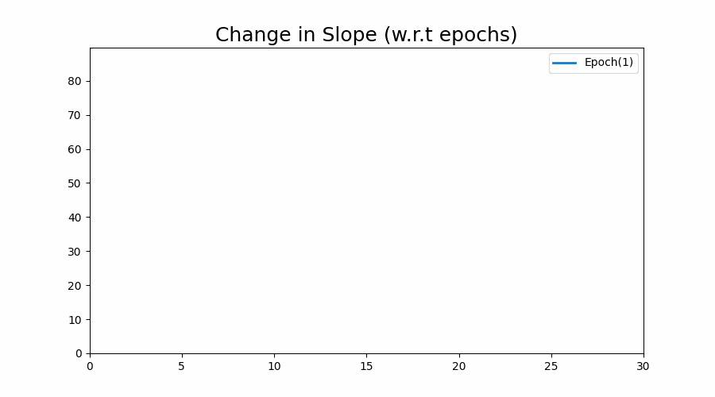

# GD Regressor

## Resources

- [Video](https://youtu.be/ORyfPJypKuU)
- [Session Notebook](https://github.com/campusx-official/100-days-of-machine-learning/tree/main/day51-gradient-descent)
- [Gradient Descent Tool](https://developers.google.com/machine-learning/crash-course/fitter/graph)
- My Notebooks for [Gradient Descent](./notebook)

### I created a Gradient Descent class from scratch and train it using artificial dataset created using `sklearn.datasets.make_regression` function.

### Also I created a class called `AnimateRegressor` which is used to create some awesome animation like below.

#### How the regression line gets fit on the data

### Below graphs shows that how does the cost/slope/intercept changes w.r.t epochs

