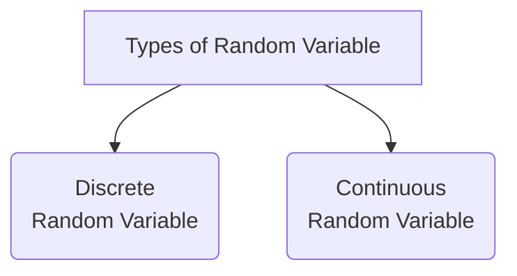
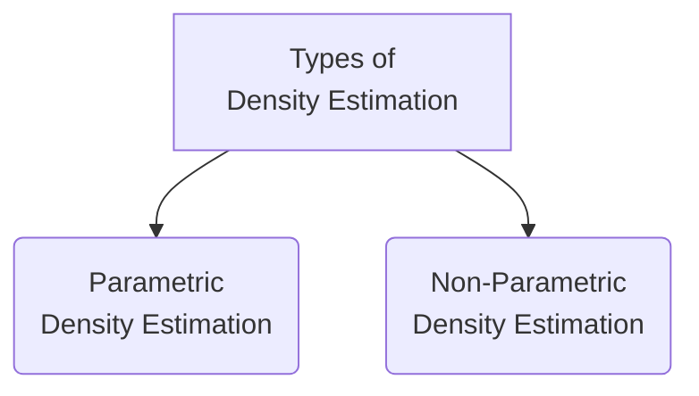

# Analysis with Statistics

## Table of Contents

0. [Resources](#resources)

1. [Random Variables](#random-variables)

2. [Types of Random Variables](#types-of-random-variables)

3. [Probability Distributions](#probability-distributions)

4. [What are Probability Distributions?](#what-are-probability-distributions?)

5. [Problem with Distribution?](#problem-with-distribution?)

6. [Solution: Probability Distribution Functions](#solution:-probability-distribution-functions)

7. [Different types of Probability Distributions](#different-types-of-probability-distributions)

8. [Why are Probability Distributions important?](#why-are-probability-distributions-important?)

9. [A note on Parameters of Probability Distribution Functions](#a-note-on-parameters-of-probability-distribution-functions)

10. [Probability Mass Function (PMF)](#probability-mass-function-pmf)

11. [Cumulative Distribution Function (CDF) of PMF](#cumulative-distribution-function-cdf-of-pmf)

12. [Probability Density Function (PDF)](#probability-density-function-pdf)

13. [Questions related to PDFs](#questions-related-to-pdfs)

14. [Density Estimation](#density-estimation)

15. [Types of Density Estimation](#types-of-density-estimation)

16. [Parametric Density Estimation](#parametric-density-estimation)

17. [Non-Parametric Density Estimation](#non-parametric-density-estimation)

18. [Kernel Density Estimate (KDE)](#kernel-density-estimate-kde)

19. [PDF, PMF and CDF](#pdf-pmf-and-cdf)

## Resources

- [Video](https://www.youtube.com/watch?v=C_QAURbgBqY&list=PLKnIA16_RmvbYFaaeLY28cWeqV-3vADST&index=4)
- [PDF](./docs/PDF.pdf)
- [Online PDF](https://drive.google.com/file/d/1FQ65CTmMLK-PYZ6NT9txGcGmJHobtNYl/view)
- [Session Notebook](https://colab.research.google.com/drive/1N_T0_w5vpT1k1Z4pSf4IMhAxYT1nRKLU?usp=sharing)

## Topics

### Random Variables

A Random Variable is a set of possible values from a random experiment.

### Types of Random Variables

### Probability Distributions

### What are Probability Distributions?

A probability distribution is a list of all of the possible outcomes of a random variable along with their corresponding probability values.

### Problem with Distribution?

In many scenarios, the number of outcomes can be much larger and hence a table would be tedious to write down. Worse still, the number of possible outcomes could be infinite, in which case, good luck writing a table for that.

> **Example:** Height of people, Rolling 10 dice together.

### Solution: Probability Distribution Functions

A probability distribution function is a mathematical function that describes the **probability of obtaining different values of a random variable** in a particular probability distribution.

### Different types of Probability Distributions

### Why are Probability Distributions important?

- Gives an idea about the shape/distribution of the data.
- And if our data follows a famous distribution then we automatically know a lot about the data.

### A note on Parameters of Probability Distribution Functions

Parameters in probability distributions are numerical values that determine the shape, location, and scale of the distribution.  
Different probability distributions have different sets of parameters that determine their shape and characteristics, and understanding these parameters is essential in statistical analysis and inference.

### Probability Mass Function (PMF)

Describes the probability distribution of a **discrete random variable**.

PMF assign a probability to each value of the random variable. The probabilities assigned by the PMF must satisfy two conditions:

1. The probability assigned to each **value must be non-negative** (i.e., greater than or equal to zero).
2. The **sum** of the probabilities assigned to all possible values must **equal 1**.

### Cumulative Distribution Function (CDF) of PMF

Describes the probability that a random variable X with a given probability distribution will be found at a value less than or equal to x.

$$ F(x) = P(X \le x) $$

**Examples:**

- [Bernoulli Distribution](https://en.wikipedia.org/wiki/Bernoulli_distribution)
- [Binomial Distribution](https://en.wikipedia.org/wiki/Binomial_distribution)

### Probability Density Function (PDF)

Describes the probability distribution of a continuous random variable.

### Questions related to PDFs

1. Why Probability Density represents the y-axis and why not Probability?

   - Because you have infinite value on the x-axis and you cannot calculate probability of each of the values of a continuous random variable dataset.

2. What does the area under the graph represents in PDF?

   - Area under the graph represents the probability of a range (3.0 to 3.1) on x-axis because you have probability density on the y-axis.

3. How to calculate Probability from PDF graph?

   - If you reduce the range of two points on x-axis with a very significant amount then you can calculate approx. probability of a point.

4. Examples of PDF:

   - [Normal Distribution](https://en.wikipedia.org/wiki/Normal_distribution)
   - [Log Normal Distribution](https://en.wikipedia.org/wiki/Log-normal_distribution)
   - [Poisson Distribution](https://en.wikipedia.org/wiki/Poisson_distribution)

5. How is graph calculated?

   - Using [Density Estimation](#density-estimation)

### Density Estimation

Density estimation is a statistical technique used to estimate the probability density function (PDF) of a random variable.

It is particularly useful in areas such as machine learning, where it is often used to estimate the probability distribution of input data or to model the likelihood of certain events or outcomes.

### Types of Density Estimation

### Parametric Density Estimation

This method estimate probability density by assuming that the random variable is follow some specific distribution such normal, exponential, log normal, or Poisson distributions.  
This estimation depends on population mean and standard deviation.

### Non-Parametric Density Estimation

When sometime the distribution of random variable is not clear or it's not one of the famous distributions.

This method estimate probability density of a random variable without making any assumption about the underlying distribution. This typically done by creating a **kernel density estimate**.

It has several **advantages over parametric density estimation**.  
One of the main advantages is that **it does not require the assumption of a specific distribution**, which allows for more flexible and accurate estimation in situations where the underlying distribution is unknown or complex.  
However, non-parametric density estimation **can be computationally intensive and may require more data to achieve accurate estimates** compared to parametric methods.

### Kernel Density Estimate (KDE)

The KDE technique involves using a kernel function to smooth out the data and create a continuous estimate of the underlying density function.

[**Watch the video for more clarity.**](https://www.youtube.com/watch?v=C_QAURbgBqY&list=PLKnIA16_RmvbYFaaeLY28cWeqV-3vADST&index=4)

### PDF, PMF and CDF

